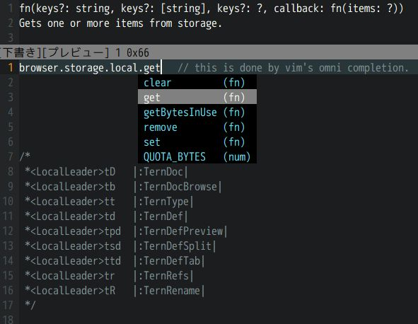

| :exclamation:  Note: `deprecated` on npm |
|------------------------------------------|

This package will never be updated for `npmjs.com`,
because local repository of `mozilla-beta` was totally broken at 2021-07-13.

Update for Nightly may be happen. Thanks.

# tern-def-webextensions


 * WebExtensions definition files for [tern](http://ternjs.net/).
   * for completion
   * open [MDN](https://developer.mozilla.org/en-US/Add-ons/WebExtensions) document
 * all things are rough.
 * [github repository](https://github.com/PrsPrsBK/tern-def-webextensions) does not contain definition-files.
 * [npm package](https://www.npmjs.com/package/tern-def-webextensions) includes only definition-files.
   * data are made of mozilla-beta repository.
   * URLs of MDN come from [mdn-browser-compat-data](https://www.npmjs.com/package/mdn-browser-compat-data).


This was introduced as one of the tool by community, thanks.
[2018-04-12 Extension development tools - Add-ons / Development - Mozilla Discourse](https://discourse.mozilla.org/t/extension-development-tools/27608)


## how to use with tern
I confirmed only with vim. install [tern-for-vim](https://github.com/ternjs/tern_for_vim) 
and add to project's `.tern-project` file.

```.tern-project
{
  "libs": [
    "browser",
    "path/to/webextensions-desktop-beta"
  ]
}
```

## make definition files

`npm run build -- --repository /path/to/local/repository`

This create 1 definition-file.
There are three API group, but I do not know how to refer between definition-files. 
So two groups are integrated, and android UI is dropped (but included in browser desktop ui).

 * genaral API
 * browser UI API
 * android UI API

### use not mozilla-beta

In case of that you would like to use nightly.

`npm run build -- --mozilla-repo /path/to/local/nightly/repository --channel nightly`

This create `webextensions-desktop-nightly.json`. 
`--channel` option only effects to filename. 
Using this option is for switching files specified within `.tern-project`. 
If you don't need to switch, there is no need for this option.


# License
MPL-2.0.

npm package includes json files. These contains contents which come from 
json schema files of mozilla-beta repository. 
Some ones are under 3-Clause BSD License, others are under MPL-2.0 License. 
Both are in `License` directory.

# Release Note

* 2018-04-10 - ver. 0.1.0
* 2018-04-12 - ver. 0.2.0
* 2018-04-28 - ver. 0.3.0
* 2018-06-21 Firefox 61(Beta) - ver. 0.4.0
* 2018-07-20 Firefox 62(Beta) - ver. 0.5.0
* 2018-08-27 Firefox 62(Beta) - ver. 0.6.0
* 2018-09-08 Firefox 63(Beta) - ver. 0.6.1
* 2018-10-16 Firefox 64(Beta) - ver. 0.7.0
* 2018-12-14 Firefox 65(Beta) - ver. 0.8.0
* 2019-01-30 Firefox 66(Beta) - No Update
* 2019-02-19 Firefox 67(Beta) - No Update
* 2019-03-28 Firefox 67(Beta) - ver. 0.8.1
  * fix: failed to pick up two functions (`userScript`, `menus`)
* 2019-05-14 Firefox 68(Beta) - ver.0.9.0
  * New: captivePortal API and 2 funcs, 2 events
  * `geckoProfiler` moved from `toolkit` to `browser`
  * `incognito` of `webRequest.RequestFilter`
* 2019-05-24 Firefox 68(Beta) - No Update
  * Removed: `mozillaAddons` permission for `telemetry` API
* 2019-07-03 Firefox 69(Beta) - ver.0.10.0
  * New: `urlbar` API
    [1547285](https://bugzilla.mozilla.org/show_bug.cgi?id=1547285)
  * New: `getProfileAsGzippedArrayBuffer` function of geckoProfiler
    [1551992](https://bugzilla.mozilla.org/show_bug.cgi?id=1551992)
  * New: `normandyAddonStudy` API
    [1522214](https://bugzilla.mozilla.org/show_bug.cgi?id=1522214)
* 2019-07-05 Firefox 69(Beta) - ver.0.11.0
  * New: `dumpProfileToFile()` of `geckoProfiler` API
    [1552845](https://bugzilla.mozilla.org/show_bug.cgi?id=1552845)
  * `topSites` API moved from `toolkit/` to `browser`
  * New: `topSites.MostVisitedURL.type`
    [1547669](https://bugzilla.mozilla.org/show_bug.cgi?id=1547669)
* 2019-08-01 Firefox 69(Beta) - ver.0.11.1
  * Move: `topSites` API from `toolkit` to `browser`
    [1569366](https://bugzilla.mozilla.org/show_bug.cgi?id=1569366)
* 2019-08-02 Firefox 69(Beta) - ver.0.11.2
  * New: `networkStatus` API
    [1550605](https://bugzilla.mozilla.org/show_bug.cgi?id=1550605)
* 2019-08-03 Firefox 69(Beta) - ver.0.11.3
  * New: `engagementTelemetry` of `urlbar` API
    [1570434](https://bugzilla.mozilla.org/show_bug.cgi?id=1570434)
* 2019-08-28 Firefox 70(Beta) - ver.0.11.4
  * New: `urlbar.contextualTip` API
    [1568708](https://bugzilla.mozilla.org/show_bug.cgi?id=1568708)
  * New: onButtonClicked and onLinkClicked events of `urlbar` API
    [1559508](https://bugzilla.mozilla.org/show_bug.cgi?id=1559508)
  * New: icon of ContextualTip of `urlbar` API
    [1559501](https://bugzilla.mozilla.org/show_bug.cgi?id=1559501)
  * New: UrlClassification properties of `webRequest` API
    [1547140](https://bugzilla.mozilla.org/show_bug.cgi?id=1547140)
  * New: `activityLog` permission and `onExtensionActivity` event
    [1542403](https://bugzilla.mozilla.org/show_bug.cgi?id=1542403)
  * Change: icon of ContextualTip of `urlbar` API
    [1575972](https://bugzilla.mozilla.org/show_bug.cgi?id=1575972)
* 2019-10-18 Firefox 71(Beta) - ver.0.12.1
  * New: `memory` API
    [1296898](https://bugzilla.mozilla.org/show_bug.cgi?id=1296898)
  * Removal: 3 functions of `proxy` API
    [1443259](https://bugzilla.mozilla.org/show_bug.cgi?id=1443259)
  * New: `onResultPicked()` of`urlbar` API
    [1578584](https://bugzilla.mozilla.org/show_bug.cgi?id=1578584)
    [1579923](https://bugzilla.mozilla.org/show_bug.cgi?id=1579923)
  * Remove: `memory` API
* 2019-11-07 Firefox 71(Beta) - ver.0.12.2
  * Removal: `details` argument of `onResultPicked()` of `urlbar` API
    [1582339](https://bugzilla.mozilla.org/show_bug.cgi?id=1582339)
* 2019-11-12 Firefox 71(Beta) - ver.0.12.3
  * New: `search()` of `urlbar` API
    [1590461](https://bugzilla.mozilla.org/show_bug.cgi?id=1590461)
* 2019-12-03 Firefox 72(Beta) - ver.0.13.0
  * New: `OnClickData` (only in definitions)
    [1405031](https://bugzilla.mozilla.org/show_bug.cgi?id=1405031)
  * New: `ftpProtocolEnabled` of `browserSettings`
    [1592687](https://bugzilla.mozilla.org/show_bug.cgi?id=1592687)
  * New: `canonicalURL` of `captivePortal`
    [1592932](https://bugzilla.mozilla.org/show_bug.cgi?id=1592932)
  * New: `respectBeConservative` of `proxy.ProxyConfig`
    [1593651](https://bugzilla.mozilla.org/show_bug.cgi?id=1593651)
  * Removal: `onProxyError()` of `proxy` API
    [1594710](https://bugzilla.mozilla.org/show_bug.cgi?id=1594710)
  * New: `focus()` of `urlbar` API
    and `options` argument of `search()` of `urlbar` API
    [1595641](https://bugzilla.mozilla.org/show_bug.cgi?id=1595641)
  * New: `closeView()` of `urlbar` API
    [1595985](https://bugzilla.mozilla.org/show_bug.cgi?id=1595985)
  * Move(No Change on the schema file): `browserAction` and `pageAction` API from `browser` to `toolkit`
    [1530402](https://bugzilla.mozilla.org/show_bug.cgi?id=1530402), especially [this](https://phabricator.services.mozilla.com/D49041)
  * New: `keyedScalarAdd()/Set()/SetMaximum()` of `telemetry` API
    [1596661](https://bugzilla.mozilla.org/show_bug.cgi?id=1596661)
  * New: `OnClickData` added as argument of `onClicked()` of `browserAction` API and `pageAction` API (fix for #1405031)
    [1595931](https://bugzilla.mozilla.org/show_bug.cgi?id=1595931)
  * New: `withHandlingUserInput()` of `test` API
    [1594786](https://bugzilla.mozilla.org/show_bug.cgi?id=1594786)
  * New: `onEngagement()` of `urlbar` API
    [1597610](https://bugzilla.mozilla.org/show_bug.cgi?id=1597610)
  * New: `tlsVersionRestriction` of `privacy.network` API
    [1593635](https://bugzilla.mozilla.org/show_bug.cgi?id=1593635)

* 2020-01-07 Firefox 73(Beta) - ver.0.14.0

  * Rename: `acceptableSources` to `sources` of `urlbar.Query` definitiion
    [1599839](https://bugzilla.mozilla.org/show_bug.cgi?id=1599839)
  * New: `toggle()` of `sidebar` API
    [1453355](https://bugzilla.mozilla.org/show_bug.cgi?id=1453355)
  * Removal: `urlbar.contextualTip` including 2 functions and 2 events
    [1590450](https://bugzilla.mozilla.org/show_bug.cgi?id=1590450)
  * Removal: `openViewOnFocus` of `urlbar` API
    [1605958](https://bugzilla.mozilla.org/show_bug.cgi?id=1605958)

* 2020-02-11 Firefox 74(Beta) - No Update
* 2020-03-10 Firefox 75(Beta) - ver.0.15.0

  * 2020-02-26 New: `zoomFullPage` and `zoomSiteSpecific` of `browserSettings`
    [1286953](https://bugzilla.mozilla.org/show_bug.cgi?id=1286953)
  * 2020-03-05 New: `toFileName` property in argument of `saveAsPDF()` of `tabs` API
    [1483590](https://bugzilla.mozilla.org/show_bug.cgi?id=1483590)

* 2020-04-06 Firefox 76(Beta) - No Update
* 2020-05-04 Firefox 77(Beta) - ver.0.16.0

  * New: `duplicateProperties` argument of `duplicate()` of `tabs` API
  * New: `goForward()` and `goBack()` functions of `tabs` API

* 2020-05-31 Firefox 78(Beta) - ver.0.17.0

  * New: `submitEncryptedPing()` function of `telemetry` API

* 2020-06-28 Firefox 79(Beta) - ver.0.18.0

  * New: `warmup()` functions of `tabs` API
  * New: `elementName` argument of `onResultPicked()` of `urlbar` API and new result `"dynamic"`
  * New: `autoload` property of `pkcs11` API

* 2020-07-27 Firefox 80(Beta) - ver.0.19.0

  * Removal: `autoload` property of `pkcs11` API

* 2020-08-24 Firefox 81(Beta) - No Update
* 2020-09-20 Firefox 82(Beta) - ver.0.20.0

  * New: `options` argument of `captureTab()` and `captureVisibleTab()` of `tabs` API gets `rect` and `scale` properties.

* 2020-10-19 Firefox 83(Beta) - No Update
* 2020-11-17 Firefox 84(Beta) - ver.0.21.0

  * New: `cookieStoreId` property of `browsingData.RemovalOptions` API

* 2020-12-08 Firefox 84(Beta) - ver.0.21.1

  * New: `network.httpsOnlyMode` property of `privacy` API
    [1678306](https://bugzilla.mozilla.org/show_bug.cgi?id=1678306)

* 2020-12-15 Firefox 85(Beta) - No Update
  * `browsing_data.json` moved from `toolkit` dir to `browser` dir
    [1625233](https://bugzilla.mozilla.org/show_bug.cgi?id=1625233)

* 2021-01-26 Firefox 86(Beta) - No Update
* 2021-02-23 Firefox 87(Beta) - No Update
* 2021-03-23 Firefox 88(Beta) - No Update: Only docstring about ftp protocol.
* 2021-06-01 Firefox 90(Beta) - No Update

## Nightly (Not released to npm)

* 2021-06-02 Removal: `import()/export()` from `bookmarks` API
  [1713674](https://bugzilla.mozilla.org/show_bug.cgi?id=1713674)
* 2021-06-17 Rename: `browserAction` API to `action` API only on Manifest V3.
  On Manifest V2, `browserAction` API still remains.
  **Now, the feature for browserAction API is completely broken, so needs fix.**
  [1706398](https://bugzilla.mozilla.org/show_bug.cgi?id=1706398)
* 2021-06-23 New: `colorManagement` of `browserSettings` API
  [1714428](https://bugzilla.mozilla.org/show_bug.cgi?id=1714428)
* 2021-07-10 New: `useWebRenderCompositor` of `browserSettings` API
  [1719688](https://bugzilla.mozilla.org/show_bug.cgi?id=1719688)

[//]: # (vim:expandtab ff=unix fenc=utf-8 sw=2)
